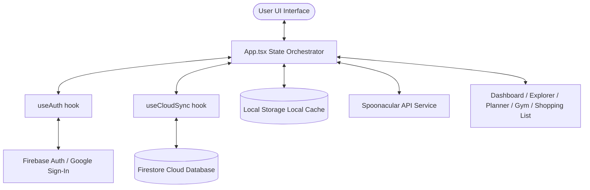

# 🍳 RecipeForge

> A premium, high-performance **Gym Diet & Meal Planner** built with React 19, TypeScript, and Tailwind CSS v4 — designed for fitness enthusiasts who demand precision nutrition, seamless cloud synchronization, and elegant UI styling.


---

## 🎨 Premium UI & Interactive Demo

RecipeForge is crafted with an immersive design philosophy:
- **Responsive Layout**: Designed for mobile, tablet, and desktop viewports.
- **Vibrant Accent Switcher**: Personalize your workspace with four curated accent palettes (**Teal**, **Gold Autumn**, **Sunset Rose**, and **Cyberpunk Indigo**).
- **System Dark/Light Mode**: Full dark and light theme support using high-contrast CSS variable remapping.
- **Fluid Micro-Animations**: Interactive hover states, page transition fades, and slide-out drawers powered by Tailwind CSS and Radix UI.

---

## ✨ Features

### 🏠 Dashboard Overview
- **Weekly Progress Summary**: At-a-glance visualization of your scheduled meals and remaining calorie/macro targets.
- **Favorite Recipes Panel**: Fast access to your top-rated and favorited recipes.
- **Quick-Access Shortcuts**: Jump to the planner, gym targets, or shopping list with a single click.

### 🔍 Recipe Explorer & Spoonacular Search
- **Curated Database**: Browse our built-in library, including a specialized, authenticated **Indian Cuisine** collection normalized by regional states.
- **Spoonacular Live Import**: Search the global Spoonacular database (over 365,000+ recipes) and import detailed ingredient lists, instructions, and macro profiles directly into your local library.
- **Advanced Filtering**: Filter recipes dynamically by categories, cooking difficulty, calories, prep time, and custom search queries.

### 📅 Weekly Meal Planner
- **7-Day Grid Scheduler**: Schedule breakfast, lunch, and dinner with ease.
- **Real-Time Macro Math**: Adjust recipe serving sizes directly in the planner grid — calorie and macro totals recalculate instantly.
- **Intuitive Empty States**: Click empty meal slots to prompt quick-scheduling drawers.

### 💪 Gym Diet Planner & Biometric Calculator
- **TDEE & BMR Calculator**: Input your body weight, activity level, and fitness goals (**Bulk / Cut / Maintenance**) to calculate:
  - **BMR** (Basal Metabolic Rate) via the Mifflin-St Jeor formula.
  - **TDEE** (Total Daily Energy Expenditure).
  - **Personalized Macro Targets** (supporting optimal muscle preservation, up to **2.4 g protein per kg** of bodyweight on a cut).
- **Goal-Matched Recipes**: Automatically highlights recipes in the explorer that fit your target macronutrient distribution.

### 🛒 Smart Shopping List
- **Automated Aggregation**: Gathers and combines ingredients from all scheduled meals.
- **Smart Deduplication**: Merges duplicate items and standardizes measurements.
- **Department Sorting**: Groups groceries by supermarket departments (Produce, Meat, Dairy, Pantry, etc.) for efficient shopping.
- **Interactive Management**: Mark items as completed, add custom shopping items manually, or clear checked items in a single tap.

### 📝 Multi-Step Custom Recipe Builder
- **Wizards-Based Creation**: A user-friendly, multi-step modal form to add your own recipes.
- **Detailed Specifications**: Enter title, preparation/cooking times, servings, difficulty, calories, macro splits, ingredients list, step-by-step instructions, and an optional YouTube tutorial link.
- **Local Integration**: Custom-built recipes appear side-by-side with official databases.

### 🎬 Embedded YouTube Tutorials
- **In-App Player**: Paste any standard YouTube link into custom recipes or built-in details. The app automatically converts the link into an embed URL, letting you watch preparation videos directly in the detail view.

### 🥗 Diet Preference Filter
- **Global Toggle**: Instantly filter recipes across the entire app (Explorer, Planner, Gym suggestions) to match **All**, **Vegetarian**, **Vegan**, or **Non-Vegetarian** dietary requirements.

---

## 🛠️ Architecture & Tech Stack

### Data Flow Diagram



### Technologies

| Layer | Technology | Description |
|---|---|---|
| **Framework** | **React 19** | Modern declarative UI rendering with functional components and hooks. |
| **Language** | **TypeScript ~6.0** | Strict mode static type checking. |
| **Styling** | **Tailwind CSS v4 + tw-animate-css** | Rapid styling with custom colors and utility-based micro-animations. |
| **Cloud Service** | **Firebase** | Firestore cloud sync database and anonymous/Google authentication. |
| **Primitives** | **Radix UI** | Accessible components (Dialog, Select, Tabs, Slider, Progress, Checkbox, Sheets). |
| **Build Tool** | **Vite 8** | High-performance build toolchain with Hot Module Replacement (HMR). |
| **Testing** | **Vitest + React Testing Library** | Suite of unit and integration tests. |

---

## 📁 Project Structure

```
typescript-project/
├── .env.example                # Example environment configuration
├── eslint.config.js            # Linter rules configuration
├── index.html                  # HTML entry point
├── package.json                # Project dependencies and script runner
├── tsconfig.json               # TypeScript path aliases and compiler flags
├── vite.config.ts              # Vite configuration
├── vitest.config.ts            # Test framework settings
├── public/                     # Public static assets
└── src/
    ├── App.tsx                 # Root application component and state orchestration
    ├── index.css               # Global styles, Tailwind directives, and theme variables
    ├── main.tsx                # Application mounting point
    ├── test-setup.ts           # Vitest environment setup
    ├── components/             # Reusable UI component layers
    │   ├── AssignMealModal.tsx      # Schedule a recipe into the weekly plan
    │   ├── CategoryFilter.tsx       # Recipe category/subcategory filter bar
    │   ├── DashboardOverview.tsx    # Home screen summary widgets
    │   ├── DietToggle.tsx           # Veg / Vegan / Non-Veg preference switcher
    │   ├── GymDietPlanner.tsx       # TDEE/BMR calculator + macro-matched recipes
    │   ├── LoginPage.tsx            # Login portal with Google and Guest options
    │   ├── ModeToggle.tsx           # Dark / Light mode toggle button
    │   ├── Navbar.tsx               # Navigation, theme switcher, and profile widget
    │   ├── RecipeBuilderModal.tsx   # Multi-step custom recipe creation form
    │   ├── RecipeCard.tsx           # Reusable recipe card with macros & actions
    │   ├── RecipeDetailModal.tsx    # Detailed recipe drawer with video embed
    │   ├── RecipeExplorer.tsx       # Searchable/filterable recipe library
    │   ├── RecipeImage.tsx          # Lazy-loaded recipe image with fallback
    │   ├── ShoppingList.tsx         # Aggregated grocery list with check-off
    │   ├── SpoonacularSearch.tsx    # Live Spoonacular search and import form
    │   ├── ThemeProvider.tsx        # Dark/Light theme context provider
    │   └── ui/                      # shadcn/ui style base primitive components
    ├── data/                   # Mock recipes and static categorization datasets
    │   ├── categories.ts            # Category definitions & migration helpers
    │   ├── indianStates.ts          # Indian cuisine subcategory normalisation
    │   └── recipes.ts               # Built-in recipe database
    ├── hooks/                  # Custom state hooks
    │   ├── useAuth.ts               # Firebase authentication handler
    │   └── useCloudSync.ts          # Automated cloud data synchronization hook
    ├── lib/                    # Library-specific code
    │   ├── __tests__/               # Test suites for helper libraries
    │   └── theme.ts                 # Accent theme application helper
    ├── services/               # API and third-party integrations
    │   ├── firebase.ts              # Firebase app initialization
    │   ├── firestoreSync.ts         # Firestore read/write sync helpers
    │   └── spoonacular.ts           # Spoonacular API wrapper
    ├── types/                  # Shared TypeScript interfaces and types
    │   └── index.ts                 # Centralized type declarations
    └── utils/                  # Pure utility functions
        ├── __tests__/               # Test suites for utility functions
        ├── diet.ts                  # Diet preference filtering logic
        ├── helpers.ts               # Shopping list compiler & misc utilities
        ├── recipeImages.ts          # Recipe image URL resolver
        └── youtube.ts               # YouTube URL → embed URL converter
```

---

## 🚀 Getting Started

### Prerequisites
- [Node.js](https://nodejs.org/) **v18+** (v20+ LTS recommended)
- npm (installed with Node.js)

### Installation

1. **Clone the repository:**
   ```bash
   git clone <your-repo-url>
   cd typescript-project
   ```

2. **Install dependencies:**
   ```bash
   npm install
   ```

3. **Configure Environment Variables:**
   Copy the example file:
   ```bash
   cp .env.example .env
   ```
   Open the newly created `.env` file and populate the keys for Spoonacular and Firebase (see below for setup instructions).

---

## ⚙️ Environment Configuration

RecipeForge operates in a zero-dependency fallback mode if no keys are provided, persisting data entirely to local storage. To activate advanced features:

### 1. Spoonacular API (Live recipe searches)
1. Register for a free account at [Spoonacular Food API](https://spoonacular.com/food-api).
2. Grab your API Key from the developer dashboard.
3. Paste it in `.env`:
   ```env
   VITE_SPOONACULAR_KEY=your_spoonacular_key_here
   ```

### 2. Firebase Cloud Sync & Authentication
1. Go to the [Firebase Console](https://console.firebase.google.com/) and create a new project.
2. Under project settings, register a web application to retrieve your Firebase configuration.
3. Enable **Firestore Database** in test or production mode.
4. Enable **Authentication** and activate:
   - **Anonymous Sign-In**
   - **Google Sign-In**
5. Populate the variables in `.env`:
   ```env
   VITE_FIREBASE_API_KEY=your_api_key
   VITE_FIREBASE_AUTH_DOMAIN=your_auth_domain
   VITE_FIREBASE_PROJECT_ID=your_project_id
   VITE_FIREBASE_STORAGE_BUCKET=your_storage_bucket
   VITE_FIREBASE_MESSAGING_SENDER_ID=your_sender_id
   VITE_FIREBASE_APP_ID=your_app_id
   ```

---

## 💻 CLI Commands

### Development Server
Start the local server with hot module replacement (HMR):
```bash
npm run dev
```
The application will run at **[http://localhost:5173](http://localhost:5173)**.

### Testing
Run the test suite using Vitest:
```bash
npm run test
```

### Coverage Reports
Generate a code coverage report for all components and utility functions:
```bash
npm run test:coverage
```

### Code Linting
Scan for code quality issues and static analysis:
```bash
npm run lint
```

### Production Build
Build optimized static files for deployment:
```bash
npm run build
```
Build output is saved to the `/dist` directory.

### Preview Production Build
Serve your build output locally to verify performance and bundle integrity:
```bash
npm run preview
```

---

## 💾 Local Persistence vs. Cloud Synchronization

The app implements a robust, priority-based storage architecture:

| Cache Key | Data Content |
|---|---|
| `recipeforge_tab` | Currently active navigation page |
| `recipeforge_theme` | Selected accent layout palette |
| `recipeforge_diet` | Dietary filter options (Veg, Vegan, etc.) |
| `recipeforge_customrecipes` | User-created custom recipes |
| `recipeforge_favorites` | Saved recipe identifier collection |
| `recipeforge_gymgoal` | Biometrics, goal definitions, and target macro splits |
| `recipeforge_mealplan` | Active weekly planner schedule |
| `recipeforge_customshopping` | Manually added shopping list items |
| `recipeforge_checkeditems` | Checked grocery list checklist states |

- **Offline Mode**: If the user is unauthenticated, all variables are read from and written to `localStorage`.
- **Cloud Migration**: Upon logging in via Google, any existing `localStorage` data is automatically synced and uploaded to your cloud profile in Firestore.
- **Real-Time Sync**: While online and logged in, changes persist to Firestore automatically, keeping your plans synced across different browsers and devices.

---

## 🗺️ Future Roadmap

- [ ] PDF export support for weekly meal plans and shopping checklists.
- [ ] Barcode scanner integration for instant ingredient lookup.
- [ ] Direct calorie and macronutrient tracking integration with popular smartwatches.
- [ ] Collaborative meal planning for families and gym partners.

---

## 📄 License

This project is private and not currently licensed for redistribution.

---
<p align="center">Built with ❤️ for precision nutrition and high performance.</p>